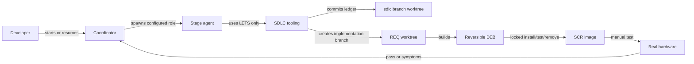
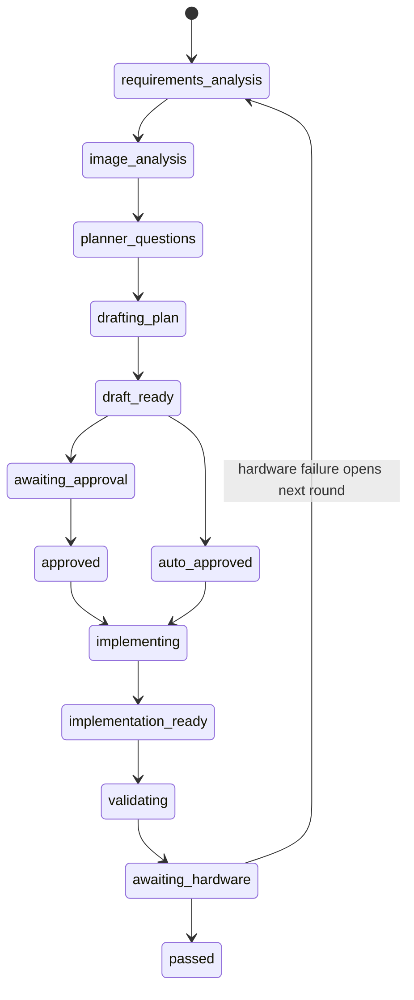

# Agentic SDLC Pipeline Developer Guide

## Purpose

The Agentic SDLC pipeline turns an SCR image requirement into a reviewed, reversible Debian package and preserves the complete history through real-hardware acceptance. It is optimized for small image fixes and features, but treats traceability, interruption recovery, and image cleanliness as hard constraints.

The pipeline combines three layers:

| Layer | Location | Responsibility |
| --- | --- | --- |
| Deterministic tooling | `tools/sdlc/` | IDs, states, locks, Git worktrees, checkpoints, package scaffolding, and restoration verification |
| Codex skills | `.agents/skills/sdlc-*` | User-facing workflow commands and automatic stage progression |
| Custom agents | `.codex/agents/sdlc-*.toml` | Specialized requirements, image, planning, implementation, validation, and follow-up behavior |

All deterministic operations go through `./bin/lets sdlc …`. Agents must not invoke the Python module or edit machine bookkeeping directly.

Stage agents persist authored material with `./bin/lets sdlc section REQ-ID
--name SECTION --file FILE`. This updates the current round, records an event,
and commits the ledger without exposing bookkeeping internals.

All SDLC subagent instructions and authored `REQ-*` sections use `$caveman full`. Compression removes filler only. Exact commands, paths, errors, hashes, evidence, requirements, safety rules, and traceability remain intact. Customer source wording stays verbatim.

## Invocation

Codex skills use `$` invocation. The repository treats the requested `/sdlc-*` spelling as a textual alias through `AGENTS.md`.

| User command | LETS operation | Purpose |
| --- | --- | --- |
| `$sdlc-new` or `/sdlc-new` | `./bin/lets sdlc new` | Mint a requirement and start Round 1 |
| `$sdlc-resume` | `./bin/lets sdlc resume` | Continue automatically from durable state |
| `$sdlc-status` | `./bin/lets sdlc status` | Report state and next gate |
| `$sdlc-approve` | `./bin/lets sdlc approve` | Approve a committed draft |
| `$sdlc-implement` | `./bin/lets sdlc implement` | Prepare the implementation worktree and begin work |
| `$sdlc-validate` | `./bin/lets sdlc validate` | Begin independent validation |
| `$sdlc-follow-up` | `./bin/lets sdlc follow-up` | Record hardware success or open another round |
| `$sdlc-list` | `./bin/lets sdlc list` | List all requirements |
| `$sdlc-show` | `./bin/lets sdlc show` | Display the complete ledger document |
| `$sdlc-abandon` | `./bin/lets sdlc abandon` | Close without success while retaining history |

Large approved plans use bounded task artifacts:

```text
./bin/lets sdlc task-plan REQ-ID --manifest task-plan.json
./bin/lets sdlc task-next REQ-ID
./bin/lets sdlc brief REQ-ID T01
./bin/lets sdlc task-result REQ-ID T01 --report-file result.json
./bin/lets sdlc task-validate REQ-ID T01 --result pass --report-file validation.json
./bin/lets sdlc acceptance REQ-ID
```

`task-plan` reads relative `contract`, `interfaces`, `acceptance`, and task-file paths from its JSON manifest. Each task declares earlier `depends_on` task IDs and covered acceptance IDs. Tooling rejects missing coverage, forward dependencies, unbounded task capsules, and plan-hash mismatch.

Use the skill form in clients that reject unknown literal slash commands.

## Architecture



Normal `sdlc` branch contains ledger and bookkeeping. It lives at `.codex/worktrees/sdlc`. Each requirement implementation uses `.codex/worktrees/REQ-<ID>-<DESC>` on own `sdlc/req-…` branch. `sdlc implementation-commit` commits only dedicated worktree.

After independent validation PASS, `sdlc resume` dispatches `sdlc_integration`. Integrator verifies exact validated commit, branch HEAD, DEB SHA-256, clean target, and source/target overlap since merge-base. Same-region semantic overlap or Git conflict stops for developer decision. Integrator runs unit tests, then invokes `sdlc merge`.

`sdlc merge` rechecks evidence and acquires cross-process `main-tree.lock` under Git common directory before ledger or target inspection. Lock key stays same across sessions and linked worktrees. Lock remains held through merge completion, safe abort, and ledger recording. No force merge. Successful merge advances to `awaiting-hardware`; ledger commits remain independent.

## Requirement identity and ledger

IDs have this form:

```text
REQ-0001-COUNT-SYSTEM-RESTARTS-RELIABLY
```

The numeric ID is four digits. The description is one to four uppercase kebab-case words. ID claims, machine state, and human documents live under `docs/requirements/` on the `sdlc` branch:

```text
docs/requirements/
├── .ids/0001
├── .state/REQ-0001-COUNT-SYSTEM-RESTARTS-RELIABLY.json
├── REQ-0001-COUNT-SYSTEM-RESTARTS-RELIABLY.md
└── artifacts/REQ-0001-COUNT-SYSTEM-RESTARTS-RELIABLY/round-1/
    ├── manifest.json
    ├── contract.md
    ├── interfaces.md
    ├── acceptance.json
    ├── tasks/T01.md
    ├── briefs/T01.md
    └── evidence/T01-result-001.json
```

The Markdown document is the complete human history. JSON state makes transitions deterministic and recoverable. The numeric claim prevents accidental ID reuse.

Task definitions may change before implementation starts. Once state becomes `implementing`, manifest definitions become immutable. `task-next` permits one active task and honors dependency order. `task-result` closes implementation work for that attempt; `task-validate` independently passes or fails it. Failed attempts remain as numbered evidence. Next task stays blocked until every dependency passes. Final `implementation-commit` and whole-package validation remain global gates.

`SDLC_SHARED_LOCK_ROOT/locks/registry.lock` serializes minting and ledger commits. Across hosts, configure that root on a shared filesystem with reliable advisory locking and use the same authoritative remote `sdlc` branch. A local file lock cannot coordinate unrelated filesystems.

## Rounds and state machine

Round 1 realizes the original customer requirement. Hardware failure closes the current round and opens the next bug-fixing round using the developer's report as input. A requirement closes only when the developer explicitly confirms hardware success.



`./bin/lets sdlc resume <REQ>` reports the next agent, tool action, or human gate. The foreground coordinator repeats this until it reaches planner questions, required approval, hardware testing, a safety decision, or a blocker.

## Planning and approval

The planner first gathers all load-bearing questions and presents them together. It writes no draft until those answers are available. The resulting plan must define:

- Exact image files and verified baseline behavior;
- Debian package names, ownership, and managed paths;
- Backup, replacement, move, deletion, upgrade, and uninstall behavior;
- Package overlap and dependency handling;
- Automated tests and hardware tests;
- The install/test/uninstall/restoration-verification sequence;
- Recovery from interrupted package operations.

The plan is written into the requirement document as a numbered `DRAFT` revision and committed before presentation. Approval records its revision and SHA-256. Amendments create another committed draft; implementation refuses a plan whose current hash differs from the approved revision.

Approval can be waived only by `sdlc trivial-policy`. A plan is trivial only when it changes no more than two payload files, defines tests, has no custom maintainer logic, and affects no boot, service, storage, security, or overlapping package surface. The reason for automatic approval is recorded.

## Debian package contract

Every image modification must be delivered by a Debian package. Direct, unowned image edits are forbidden. Removing all packages produced for a requirement must restore every requirement-managed path to its pre-install state.

Create a scaffold after approval:

```bash
./bin/lets sdlc package-init REQ-0001 \
  --operation replace:/etc/monit/monitrc \
  --operation add:/usr/lib/scr/recovery-helper \
  --operation move:/etc/old.conf:/etc/new.conf
```

Supported operations are `add`, `replace`, `delete`, and `move`. The generated maintainer scripts:

- Capture pre-existing paths with metadata before installation;
- Record paths that were originally absent;
- Refuse overlap with another active SDLC package;
- Apply delete and move operations during configuration;
- Restore originals and remove newly added paths during removal;
- Retain backups across upgrades instead of replacing the original baseline.

Payload files for `add` and `replace` go under
`payload/<absolute-target-path>`. The DEB owns this private tree under
`/usr/lib/<package>/payload`; `postinst` copies the payload into place after the
baseline is backed up. This avoids ownership collisions with existing Debian
packages. Do not install managed replacements directly or declare them as
conffiles because ordinary removal preserves conffiles.

The generated scaffold is a starting point, not approval to skip package review. Directory creation, services, maintainer-script interruption, ownership, permissions, capabilities, ACLs, and package upgrades require tests when applicable.

## Image locking and cleanliness

The image lock is held continuously across:

```text
lock → mount → baseline fingerprint → install → test → uninstall
     → restoration fingerprint → unmount → unlock
```

Wrap arbitrary mount workflows with:

```bash
./bin/lets sdlc lock-run --image var/image_8.26.0 -- command arguments
```

The preferred end-to-end test copies the image, mounts the disposable copy,
validates package restoration, unmounts it, and verifies that the source image
was untouched:

```bash
./bin/lets sdlc test-package REQ-0001 \
  --image var/image_8.26.0 \
  --deb ./package.deb \
  --test-command '/usr/lib/scr/package-test'
```

For an already mounted disposable root, validate only the package lifecycle with:

```bash
./bin/lets sdlc verify-package REQ-0001 \
  --root ./image \
  --deb ./package.deb \
  --test-command '/usr/lib/scr/package-test'
```

The verifier fingerprints the filesystem, installs the package, runs its test, removes the package, and compares the restored filesystem before releasing the lock. If cleanup differs, it writes a quarantine marker under `.codex/sdlc/quarantine/` and fails. Later operations refuse the quarantined image until an explicit recovery run verifies it.

Normal package-manager and runtime bookkeeping paths are excluded through `SDLC_VERIFY_EXCLUDES`; requirement-managed payload paths must never be excluded. Exact byte-for-byte preservation of a shared raw image is stronger than Debian uninstall semantics because `dpkg` updates its database and logs. Use a disposable copy or snapshot when whole-image byte identity is required, while still requiring semantic restoration of all managed paths.

`flock` coordinates multiple processes only when they see the same lock inode. Cross-host image mutation therefore requires `.codex/sdlc/` on a shared filesystem with reliable advisory locking, or an external distributed lease. Separate hosts with separate lock directories must not mutate the same image.

## Configuration and agents

All model and reasoning choices live in `etc/sdlc.conf`. Custom agent TOMLs intentionally omit those fields so the coordinator can pass the configured values when spawning agents.

Inspect the effective assignments with:

```bash
./bin/lets sdlc models
```

The configuration also controls the ledger branch, remote synchronization, lock timeout, shared lock root, and verification exclusions. Every host that can touch the same image must set `SDLC_SHARED_LOCK_ROOT` to the same shared location; the default is repository-local and therefore coordinates only hosts sharing that checkout filesystem.

## Interruption recovery

The ledger is checkpointed after every completed stage and the DRAFT is committed before it is displayed. After interruption:

```bash
./bin/lets sdlc status REQ-0001 --json
./bin/lets sdlc resume REQ-0001
```

The coordinator resumes from the durable state rather than repeating completed stages. Package verification writes a phase journal in `.codex/sdlc/`. A restoration mismatch leaves a persistent quarantine marker even though process termination releases the operating-system lock.

Never delete a quarantine marker by hand. Inspect the journal, restore the image, and run the explicit recovery verification.

## Development and testing

Run the deterministic unit suite through LETS:

```bash
./bin/lets sdlc test
```

The default suite uses temporary Git repositories and does not mount images or require root. Real package/image testing is an integration activity and requires a disposable image or snapshot plus the complete lock-bounded workflow.

Before changing the pipeline:

1. Update deterministic behavior in `tools/sdlc/src/sdlc.py`.
2. Expose it through a LETS leaf under `tools/sdlc/`.
3. Update the relevant skill and agent contract.
4. Add state-machine or safety regression tests.
5. Update this guide when user-visible behavior or invariants change.
