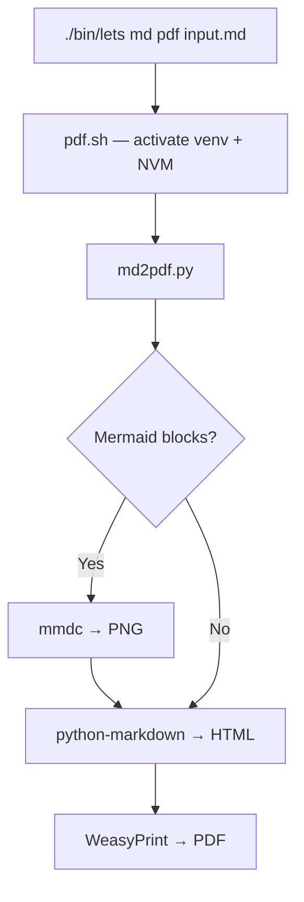
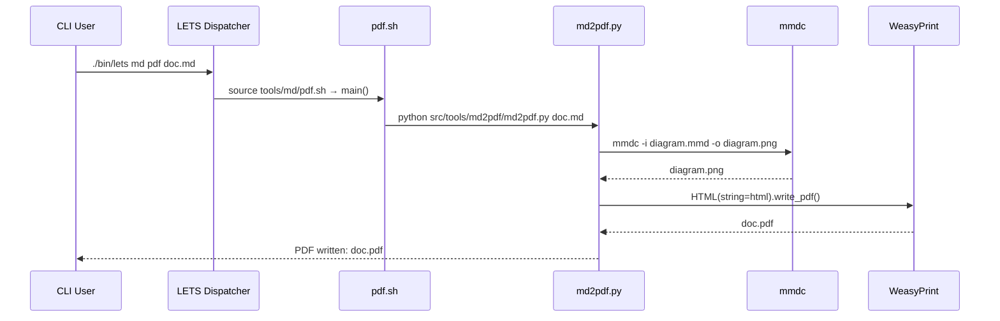
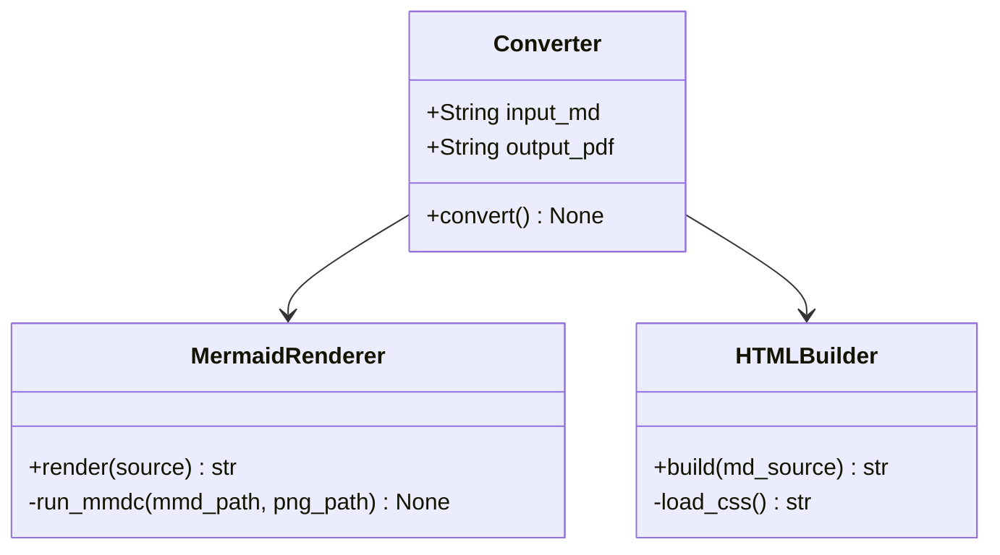

# md2pdf Feature Test Document

This document exercises every supported Markdown feature and serves as the primary visual regression reference for the `./bin/lets md pdf` converter.

<div style="page-break-after: always;"></div>

# Headings

## H2 — Section Heading

### H3 — Sub-Section

#### H4 — Sub-Sub-Section

##### H5 — Minor Heading

###### H6 — Smallest Heading

<div style="page-break-after: always;"></div>

# Inline Formatting

**Bold text** and *italic text* and ***bold italic text***.

~~Strikethrough~~ and `inline code` and a [hyperlink](https://example.com).

> This is a single-level blockquote. It should have a left border and subtle background.

> **Nested blockquotes**
>
> > Inner quote — indented further.
> >
> > > Triple nesting.

<div style="page-break-after: always;"></div>

# Lists

## Unordered Lists

- Alpha
- Beta
  - Beta One
  - Beta Two
    - Beta Two A
    - Beta Two B
- Gamma

## Ordered Lists

1. First item
2. Second item
   1. Sub-item A
   2. Sub-item B
3. Third item

## Task Lists

- [x] Completed task
- [x] Another completed task
- [ ] Pending task
- [ ] Another pending task
  - [x] Nested completed sub-task
  - [ ] Nested pending sub-task

<div style="page-break-after: always;"></div>

# Code Blocks

## Python

```python
from dataclasses import dataclass
from typing import Optional


@dataclass
class Document:
    title: str
    content: str
    author: Optional[str] = None

    def word_count(self) -> int:
        return len(self.content.split())


def convert(doc: Document, output_path: str) -> None:
    """Convert document to PDF."""
    if not doc.content:
        raise ValueError("Document content is empty")
    print(f"Converting '{doc.title}' ({doc.word_count()} words) → {output_path}")
```

## Bash

```bash
#!/usr/bin/env bash
set -euo pipefail

INPUT="${1:?usage: $0 <input.md> [output.pdf]}"
OUTPUT="${2:-${INPUT%.md}.pdf}"

./bin/lets md pdf "$INPUT" "$OUTPUT"
echo "Done: $OUTPUT"
```

## JSON

```json
{
  "tool": "md2pdf",
  "version": "1.0",
  "options": {
    "page_size": "A4",
    "mermaid": true,
    "syntax_highlight": true,
    "style": "github"
  },
  "dependencies": [
    "python-markdown",
    "weasyprint",
    "pygments",
    "mermaid-cli"
  ]
}
```

## Plain text block

```
This is a plain text block.
No syntax highlighting applied.
Useful for terminal output or configuration snippets.
    Indented line preserved.
```

<div style="page-break-after: always;"></div>

# Tables

## Simple Table

| Name      | Type     | Required | Default  |
|-----------|----------|----------|----------|
| input_md  | `string` | Yes      | —        |
| output_pdf| `string` | No       | `<input>.pdf` |
| style     | `string` | No       | `style.css` |

## Wide Table — Multiple Columns

| Component           | Language | Role                        | Owner   | Priority |
|---------------------|----------|-----------------------------|---------|----------|
| Agent               | C++      | Edge service on device       | Agent   | P1       |
| Manager             | Java     | Central mission control      | Manager | P1       |
| Dashboard           | GUI      | Real-time situational picture| Dash    | P2       |
| Statistics Collector| Embedded | Telemetry processing         | Agent   | P1       |

## Alignment

| Left-aligned | Center-aligned | Right-aligned |
|:-------------|:--------------:|--------------:|
| Alpha        | Beta           | 1,000         |
| Gamma        | Delta          | 2,500         |
| Epsilon      | Zeta           | 10,000        |

<div style="page-break-after: always;"></div>

# Mermaid Diagrams

## Flowchart — Conversion Pipeline



## Sequence Diagram — Request Flow



## Class Diagram



<div style="page-break-after: always;"></div>

# Images

## Local PNG Asset


The image above is a locally referenced PNG file (`assets/test-image.png`), relative to this document. It should render inline at full width (capped at 100% of the content column).

<div style="page-break-after: always;"></div>

# Horizontal Rules

Content above the rule.

---

Content below the rule.

---

# Mixed Content Block

A real-world paragraph mixing **bold**, *italic*, `code`, a [link](https://weasyprint.org), and plain text.
The renderer should handle all of these inline elements together without spacing or encoding artifacts.

> **Note:** Long blockquote that wraps across lines. The left border should remain straight and the background should span the full block. Lorem ipsum dolor sit amet, consectetur adipiscing elit, sed do eiusmod tempor incididunt ut labore et dolore magna aliqua.

```python
# Verify no page-break splits a code block mid-way
for i in range(10):
    print(f"line {i}: {'x' * 60}")
```

| A | B | C | D | E |
|---|---|---|---|---|
| 1 | 2 | 3 | 4 | 5 |
| 6 | 7 | 8 | 9 | 10 |
